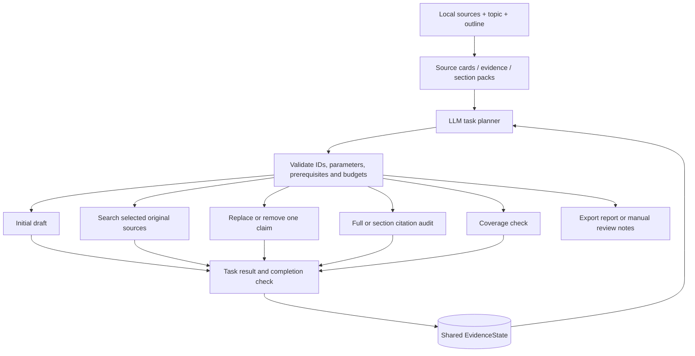

# Source-Grounded Review

A report-writing system with an LLM task planner, source-specific evidence retrieval, and citation review. Give it local source files, a topic, and an optional outline. It prepares section evidence packs, drafts a report, and lets the planner decide which sources to revisit, which claims to revise, and when the result needs human review.

The planner issues concrete tasks with source IDs, claim IDs, search queries, and completion criteria. Each tool returns an observation before the planner chooses its next task. Reports include the supporting evidence and the decisions that led to each repair.

It is useful for literature reviews, technical research, market or policy reports, meeting-note synthesis, and other writing tasks where citations need to point back to the original material.

## What It Does

- Reads PDF, TXT, Markdown, JSON, JSONL, CSV, TSV, HTML, and other text-based files.
- Builds a structured source card for each file, including topic tags, method tags, useful sections, key findings, and limitations.
- Extracts citable evidence snippets with source paths, page hints, and related outline sections.
- Selects representative evidence for each outline section while reducing repeated use of the same source.
- Drafts a review or research report from the selected evidence.
- Checks whether cited statements are supported by the corresponding evidence.
- Plans targeted retrieval, single-claim revisions, and section audits using the actual claim text and audit findings.
- Reopens selected original files to retrieve new evidence, including passages beyond the initial source-card text limit.
- Validates new quotes against source text and records page hints, extracted-text offsets, context, and source-text hashes.
- Exports citation checks, citation bindings, coverage reports, and manual review notes.

## Project Layout

```text
.
├── src/source_grounded_review/
│   ├── steps/            # Source reading, outline matching, evidence selection, writing, and checks
│   ├── core/             # Data models, model client, SQLite records, and utility functions
│   ├── io/               # Source loading, reference CSV handling, and outline parsing
│   ├── orchestration/    # Task planner, shared state, and execution backends
│   ├── reporting/        # Run summaries
│   └── cli.py            # Command-line entry point
├── examples/             # Small runnable example
├── scripts/              # Filename normalization helpers
├── tests/                # Planner contracts and repair-loop regression tests
├── data/inputs/.gitkeep  # Placeholder for local input files
├── pyproject.toml
├── requirements.txt
└── README.md
```

## Install

```powershell
python -m venv .venv
.\.venv\Scripts\activate
pip install -r requirements.txt
```

Copy the environment template:

```powershell
copy .env.example .env
```

Example `.env`:

```env
LLM_PROVIDER=mock
DEEPSEEK_API_KEY=
DEEPSEEK_MODEL=deepseek-chat
```

## Quick Start

Run the included mixed-format example:

```powershell
$env:PYTHONPATH="src"

python -m source_grounded_review.cli `
  --topic "Digital governance for community elderly-care services: practice, risk, and evaluation" `
  --input-dir examples\inputs `
  --outline examples\outline.md `
  --output-dir outputs\demo `
  --provider mock
```

If the package is installed, you can also use the script entry point:

```powershell
evidence-review --topic "Your research topic" --input-dir data\inputs --output-dir outputs\run --provider mock
```

## DeepSeek

Configure `.env` first:

```env
LLM_PROVIDER=deepseek
DEEPSEEK_API_KEY=your_api_key
DEEPSEEK_MODEL=deepseek-chat
```

Then run:

```powershell
$env:PYTHONPATH="src"

python -m source_grounded_review.cli `
  --topic "Your research topic" `
  --input-dir data\inputs `
  --outline examples\outline.md `
  --output-dir outputs\deepseek_run `
  --provider deepseek `
  --model-select-evidence `
  --planner llm
```

`--references` is optional. If it is not provided, all readable files under `--input-dir` are treated as pre-selected sources and assigned IDs such as `P001`, `P002`, and so on.

## Planner Mode

The review loop can route steps in two ways:

```powershell
--planner rules
```

Uses deterministic routing. This is the default mode and is useful for repeatable local runs.

```powershell
--planner llm
```

Uses the configured model to plan concrete tasks after source preparation. The planner sees individual unsupported claims, audit explanations, source summaries, section evidence, coverage gaps, and previous task outcomes. It chooses a tool and its parameters, then updates its provisional plan after observing the result.

Use this mode with `--provider deepseek`. `mock` does not simulate autonomous decisions: an invalid planner response is retried once, then recorded for human review. It is useful for checking that this stop path works.

## Planning Controller

The implementation has three responsibilities:

- **Planning:** [`task_planner.py`](src/source_grounded_review/orchestration/task_planner.py) builds observations, validates model-generated tasks, tracks budgets, and records task outcomes.
- **Execution:** [`review_loop.py`](src/source_grounded_review/orchestration/review_loop.py) maintains `EvidenceState` and runs the same tasks through either a local loop or LangGraph conditional edges. Choose `--graph-backend langgraph` to use LangGraph; the CLI default is `local`.
- **Targeted tools:** [`targeted.py`](src/source_grounded_review/steps/targeted.py) retrieves original-source quotes and replaces a single claim without regenerating surrounding sections. [`audit.py`](src/source_grounded_review/steps/audit.py) reviews only evidence from the cited sources.

Source preparation follows its data dependencies. Once section packs exist, the task planner controls writing, targeted retrieval, revision, review, and completion:



A retrieval task looks like this (illustrative IDs):

```json
{
  "action": "retrieve_evidence",
  "goal": "Check whether the runtime benchmark measured deployment costs",
  "reason": "The draft claims a cost reduction, but selected evidence only describes throughput",
  "parameters": {
    "section_id": "S1",
    "source_ids": ["P001"],
    "query": "deployment cost measurements and benchmark limitations"
  },
  "success_criterion": "new_source_quotes",
  "remaining_plan": [
    "Inspect the returned passages for support or limitations",
    "Narrow or remove the cost claim if necessary",
    "Re-audit the affected section"
  ]
}
```

`remaining_plan` is provisional. Only the current task is executed; later steps are reconsidered against the next observation. Completion criteria are fixed tool contracts, not arbitrary model promises. Finding a source quote satisfies a retrieval task, but does not establish that a draft claim is supported.

| Tool | Model-selected parameters | Result |
|---|---|---|
| `retrieve_evidence` | Section, 1-3 source IDs, query, optional claim ID | Up to four exact source quotes, provenance, or an explicit no-result observation |
| `revise_claim` | Section, claim ID, 1-8 evidence IDs, revision instruction | One replacement or deletion, with before/after text; semantic audit remains pending |
| `audit_section` | Section ID | Refreshed claim checks for that section; other sections retain their audit IDs |
| `write_draft` | Initial draft action | Report based on section packs |
| `audit_citations` | Full-draft audit action | Claim support checks restricted to cited sources |
| `coverage_critic` | Coverage action | Source usage and section coverage |
| `human_review` | Goal and reason | Unresolved claims, missing sections, validation errors, and coverage gaps |
| `finalize` | Completion action | Final outputs after required checks pass |

Tool availability follows prerequisites: a changed section must be audited before another edit, and finalization requires current model-based support checks, nonempty audited sections, and adequate evidence counts. A heuristic audit fallback cannot satisfy the semantic completion gate. Invalid tasks get one model retry; repeated failures or exhausted budgets produce manual-review notes.

The default task budget is 24, with at most four original-source retrieval tasks and six claim revisions. The same task and parameters may execute at most twice. Three consecutive failed or no-progress tasks stop automatic work. These limits bound execution; they do not guarantee a publishable report.

The planner can select tools and parameters within this writing task. It cannot invent new tools, browse for external sources, execute arbitrary code, or change the user's outline. Initial source-card reading samples text windows, and targeted retrieval ranks six windows per requested source before model extraction. Semantic audits remain model judgments; relevant passages outside these windows can be missed.

## Basic Flow

1. Load source files provided by the user.
2. Build a source card for each file.
3. Extract citable evidence snippets.
4. Match sources and evidence to outline sections.
5. Select representative evidence for each section.
6. Draft the review or research report.
7. Check whether citations match the supporting evidence.
8. Export coverage reports and manual review notes.

The default command uses the rule-based review loop, which can broaden evidence selection or rewrite the draft. In LLM mode, the task controller takes over after step 5. For a one-pass run, add:

```powershell
--linear
```

## Step Inputs and Outputs

| Step | Main input | Main output |
|---|---|---|
| `load_corpus` | Topic, input directory, optional reference CSV, optional outline file | `documents`, `sections` |
| `build_source_cards` | Loaded documents and outline sections | `source_cards` |
| `build_evidence_matrix` | Documents, source cards, topic, outline sections | `evidence_rows` |
| `outline_mapper` | Source cards, evidence rows, outline sections | `assignments`, `outline_map` |
| `select_evidence` | Assignments, evidence rows, source cards, section limits | `selected_evidence_by_section`, `selection_rows` |
| `build_section_packs` | Sections, assignments, selected evidence | `section_packs` |
| `expand_evidence` | Current section-coverage state and selection budgets | Larger evidence-selection budgets |
| `write_draft` | Topic, outline sections, section evidence packs | `draft` |
| `audit_citations` | Draft and evidence matrix | `citation_audit_results`, `citation_bindings` |
| `rewrite_draft` | Draft, section packs, citation-audit feedback | Revised `draft` |
| `coverage_critic` | Draft, documents, assignments, section packs | `coverage_report`, source-usage rows |
| `human_review` | Current risk state | `manual_review_notes.md` |
| `finalize` | Full `EvidenceState` | Output folder with draft, tables, trace, and reports |

`expand_evidence` and `rewrite_draft` belong to rules mode. LLM mode uses `retrieve_evidence` and `revise_claim` instead; the former extracts new original-source passages and the latter changes only a selected claim.

## Main Outputs

```text
draft/review_draft.md                   # Generated draft
audit/citation_audit_results.csv        # Citation check table
bindings/citation_bindings.csv          # Sentence -> citation -> evidence binding
evidence/evidence_matrix.csv            # Evidence snippet table
corpus/source_cards.json                # Source cards
packs/section_evidence_packs.json       # Evidence pack used by each section
coverage/coverage_report.md             # Section coverage report
manual_review/manual_review_notes.md    # Items that need manual review
trace/step_decisions.csv                # Why each step continued, looped back, or finished
trace/task_history.json                # LLM tasks, parameters, validation attempts, and observations
report/task_report.md                  # Readable task history, including before/after changes
state/evidence_state.sqlite            # Task events, state summaries, and output metadata
report/run_summary.md                   # Run summary
```

## Common Options

- `--max-sources 5`: read only the first five sources for a small trial run.
- `--evidence-per-source 10`: keep up to ten evidence snippets per source.
- `--max-refs-per-section 6`: use up to six sources per outline section.
- `--max-evidence-per-section 10`: use up to ten evidence snippets per section.
- `--model-select-evidence`: use the configured model to help select final section evidence. Without this flag, rule-based ranking is used.
- `--planner llm`: use the configured model to plan parameterized writing and repair tasks.
- `--max-agent-tasks 24`: task budget in LLM mode (1-30), excluding a final forced review stop.
- `--max-retrieval-tasks 4`: maximum targeted retrieval tasks in LLM mode.
- `--max-claim-revisions 6`: maximum single-claim revision tasks in LLM mode.
- `--max-revision-rounds 2`: maximum full-draft rewrite rounds in rules mode.
- `--max-evidence-expansion-rounds 2`: maximum evidence-selection expansion rounds in rules mode.

## Verification

Run the regression suite without an API key:

```powershell
$env:PYTHONPATH="src"
python -m unittest discover -s tests -v
```

The repair-loop tests seed an unsupported deployment-cost claim and exercise two distinct paths: retrieving a missing limitation before revising, and revising directly when existing evidence is sufficient. They also check exact source offsets, page boundaries, invented-quote rejection, preservation of unrelated text, stable audit IDs, planner validation, budgets, and SQLite task events. Scripted model responses test execution contracts, not real-model accuracy.

A [recorded DeepSeek repair example](examples/planner_demo/repair_result.md) shows the six actual tasks that changed an unsupported cost-reduction claim into a source-supported limitation. The same page includes a runnable two-file generation example. Both use synthetic material; these checks demonstrate behavior, not a corpus-level accuracy score.

## Filename Normalization

If input PDF filenames are messy, copy them into a new directory with names like `P001_title.pdf`:

```powershell
$env:PYTHONPATH="src"

python scripts\normalize_pdf_filenames.py `
  --input-dir data\inputs `
  --out-dir data\normalized
```

If you already have a reference CSV, use it to normalize filenames by reference ID and title:

```powershell
$env:PYTHONPATH="src"

python scripts\normalize_source_filenames.py `
  --references references.csv `
  --input-dir data\inputs `
  --out-dir data\normalized
```
